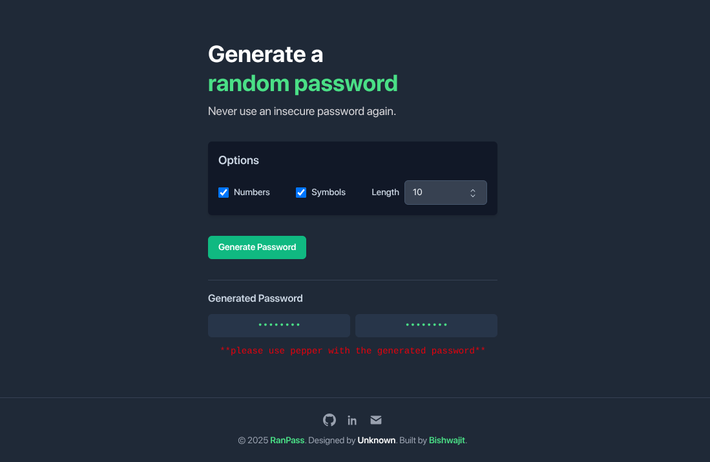
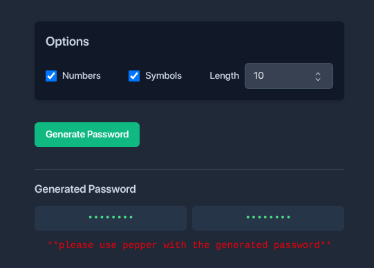

# 🔐 RanPass – Random Password Generator

RanPass is a sleek and responsive web-based password generator built using **HTML**, **Tailwind CSS**, and **JavaScript**. It allows users to instantly generate strong, secure passwords with customizable options like length, numbers, and symbols.

 <!-- Add screenshot if available -->

## ✨ Features

- ✅ Generate random secure passwords
- 🔢 Choose password length (6 to 16 characters)
- 🔒 Include numbers and/or symbols
- 📋 Click to copy passwords to clipboard
- 🧠 Tooltip for copy confirmation
- 📱 Mobile responsive design
- 🎨 Built with Tailwind CSS for modern UI
- ⚠️ Password peppering reminder for extra security

---

## 🚀 Live Demo

👉 [View Demo](https://bishwajit-2810.github.io/RanPass/)

---

## 🛠️ Tech Stack

- **HTML5**
- **Tailwind CSS**
- **Vanilla JavaScript**

---

## 📷 Screenshots

<!-- Upload images and update paths -->

---

## 💡 How to Use

1. Open the webpage.
2. Choose your desired:
   - Password length
   - Inclusion of numbers
   - Inclusion of symbols
3. Click **"Generate Password"**
4. Click on a password to copy it to clipboard.
5. (Optional) Add your own "pepper" before using.

---

## 📁 Project Structure

📦 RanPass
├── index.html
├── output.css
├── README
├── LICENSE
└── screenshots

---

## 📬 Contact

- **Developer**: Bishwajit Chakraborty
- 📧 Email: [bishwajit2810@gmail.com](mailto:bishwajit2810@gmail.com)
- 🌐 Portfolio: [https://bishwajit-2810.github.io/](https://bishwajit-2810.github.io/)
- 🔗 LinkedIn: [linkedin.com/in/bishwajit-chakraborty](https://www.linkedin.com/in/bishwajit-chakraborty/)
- 💻 GitHub: [Bishwajit-2810](https://github.com/Bishwajit-2810)

---

## 🖤 Credits

- Built with 💚 by [**Bishwajit**](https://github.com/Bishwajit-2810)
- Inspired by security best practices & password entropy
- UI by unknown dev

---

## 📄 License

This project is licensed under the [MIT License](LICENSE).
